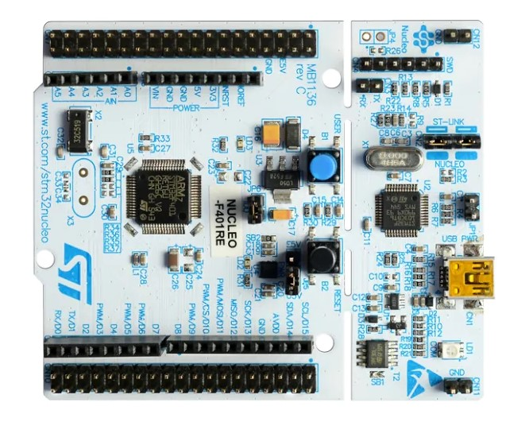

# Sinusoidal Wave Generator Using STM32-F446RE Nucleo Board
Design and Implementation of Sinusoidal Wave Generator Using [STM32-F446RE Nucleo Board](https://www.st.com/en/evaluation-tools/nucleo-f446re.html).

## STM32-F446RE Nucleo Board
I use this development board in this project

